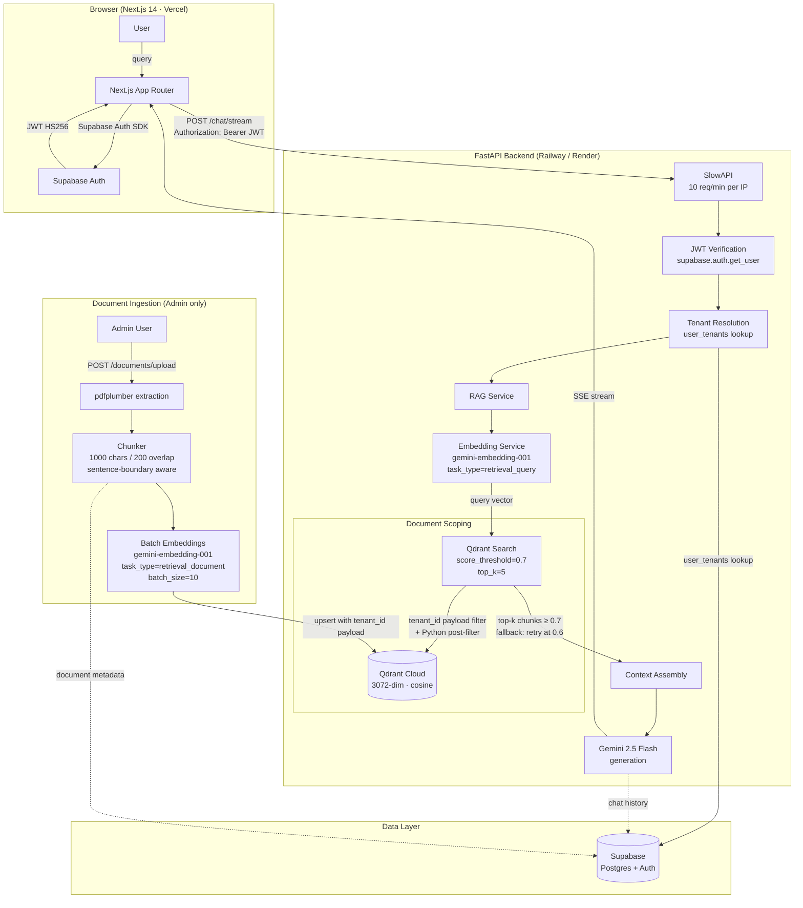
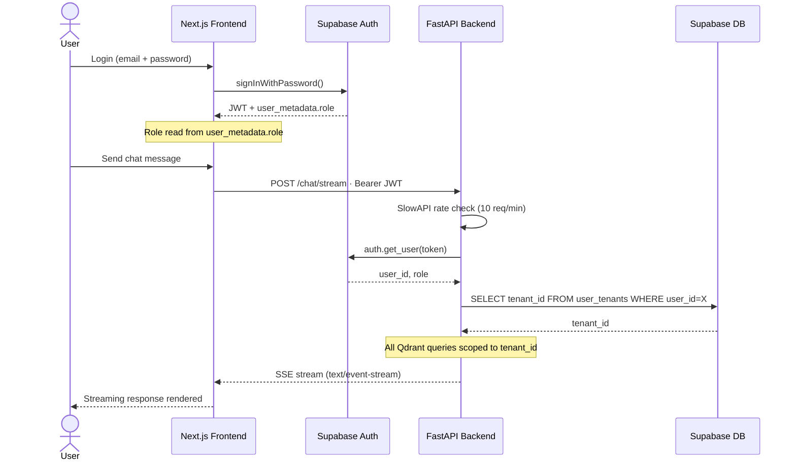

# Ganatra Chatbot

A production-ready RAG chatbot built with Next.js 14, FastAPI, Supabase, Qdrant Cloud, and Google Gemini. Upload PDFs, ask questions, get context-aware streamed answers — with role-based access and JWT-secured endpoints throughout.

## Architecture



## Auth Flow



## Tech Stack

| Layer | Technology |
|---|---|
| Frontend | Next.js 14, TypeScript, Tailwind CSS, shadcn/ui |
| Auth | Supabase Auth (JWT HS256) |
| Backend | FastAPI (Python 3.9+), Railway / Render |
| LLM | Google Gemini 2.5 Flash (streaming) |
| Embeddings | gemini-embedding-001 (3072-dim, cosine) |
| Vector DB | Qdrant Cloud (payload-indexed) |
| Database | Supabase Postgres |
| Rate Limiting | SlowAPI (10 req/min per IP) |

## Features

- PDF document ingestion and processing (Admin only)
- RAG pipeline for context-aware, grounded responses
- Streaming chat via SSE (`text/event-stream`)
- Role-based access control (Admin / User)
- JWT-secured endpoints with Supabase Auth
- Rate limiting and file size enforcement (10MB)
- OpenRouter fallback for LLM provider switching

## Design Decisions

### Why Qdrant over Pinecone or FAISS

**Pinecone's** free tier enforces a single namespace per index. Multi-tenant scoping would require one index per tenant or client-side filtering — both expensive. Qdrant's `FieldCondition` payload filter runs server-side before vector scoring, so only matching points are scored.

**FAISS** is in-process only — no persistence layer, no HTTP API. Horizontal scaling requires custom infrastructure. Qdrant Cloud provides a managed cluster with the same client API as the self-hosted version, making local development identical to production.

**Trade-off accepted:** Qdrant's free-tier cluster is single-region with limited throughput. Sufficient at current scale; upgrading the cluster tier requires no code changes.

---

### Document Scoping with `tenant_id`

Every vector point in Qdrant carries a `tenant_id` in its payload, indexed as a keyword field. At query time a `FieldCondition(key="tenant_id", match=MatchValue(value=tenant_id))` filter is applied server-side before vector scoring. A Python post-filter then double-checks every returned point's `payload_tenant_id` against the resolved `tenant_id` — guarding against index misconfiguration.

The `tenant_id` is resolved from the `user_tenants` table on the server, never from the request payload. This means it cannot be spoofed by a client sending an arbitrary JWT. The schema supports adding more tenants without a collection-level change — only the resolution logic would need updating.

---

### RAG Pipeline Design

**Chunking strategy:** `chunk_text()` targets 1,000 characters with 200-character overlap. The chunker looks backward through the last 20% of each window for sentence terminators (`. ! ?`) before falling back to `\n\n` then `\n`. This avoids mid-sentence splits that degrade retrieval quality.

**Why character counts, not token counts:** `gemini-embedding-001` accepts up to 2,048 tokens. At ~4 chars/token, 1,000 characters is ≈ 250 tokens — well within budget and avoids a tokenizer dependency in the ingest pipeline.

**Asymmetric task types:** The Gemini embedding API distinguishes `task_type="retrieval_document"` (used at ingest) from `task_type="retrieval_query"` (used at query time). These produce embeddings optimized for document-query similarity rather than document-document similarity, which materially improves retrieval precision.

**Similarity threshold with fallback:** Primary threshold is 0.7 (cosine). If no results pass, the search retries at 0.6. If still empty, a "no relevant documents found" response is returned rather than letting the LLM hallucinate from weak context. The two-level approach handles borderline queries without dropping quality.

**Batch embeddings:** `generate_embeddings_batch()` uses `batch_size=10` with an inter-batch delay tuned for Gemini API free-tier rate limits. Both values are configurable via environment variables.

---

### Why Google Gemini

**Single provider for embedding and generation.** Using `gemini-embedding-001` and `gemini-2.5-flash` from the same API eliminates cross-provider key management and keeps the dependency surface minimal.

**Latency profile.** `gemini-2.5-flash` is optimized for low-latency, high-throughput use cases. For a streaming chat interface, first-token latency matters more than maximum context length.

**OpenRouter fallback.** An `OpenRouterProvider` is wired up alongside `GeminiProvider`. Setting `DEFAULT_LLM_PROVIDER=openrouter` switches the generation model with no code change — useful for cost experimentation or if Gemini API terms become a constraint.

---

### Streaming via SSE, not WebSockets

SSE (`text/event-stream`) is unidirectional — exactly what a streamed LLM response requires. It auto-reconnects on network interruption, needs no library on the client side (native `EventSource` or `fetch` + `ReadableStream`), and works on Render and Vercel without configuration. Each chunk is serialized as `data: {"content": "...", "done": false}\n\n` with a terminal `done: true` sentinel.

---

## Project Structure

```
.
├── backend/                 # FastAPI backend
│   ├── app/
│   │   ├── api/            # Routes (chat, documents, admin, auth, tenants)
│   │   ├── models/         # Pydantic models
│   │   ├── services/       # RAG, LLM, embeddings, Qdrant, auth, tenant
│   │   ├── utils/          # PDF processor, chunker, web scraper
│   │   └── main.py         # FastAPI app entry point
│   └── requirements.txt
│
└── frontend/               # Next.js frontend
    ├── app/                # App Router pages (auth, chat, admin, settings)
    ├── components/         # Chat UI, admin dashboard, shadcn/ui
    ├── lib/                # API clients, Supabase setup
    ├── hooks/              # Custom React hooks
    └── types/              # TypeScript types
```

## API Reference

| Method | Endpoint | Auth | Description |
|---|---|---|---|
| POST | `/chat` | User | Send chat message |
| POST | `/chat/stream` | User | Streaming chat (SSE) |
| POST | `/documents/upload` | Admin | Upload PDF |
| DELETE | `/documents/{id}` | Admin | Delete document |
| GET | `/admin/stats` | Admin | System statistics |
| POST | `/admin/rebuild-index` | Admin | Rebuild vector index |

All endpoints except `/` and `/health` require `Authorization: Bearer <jwt>`. Role (`admin` / `user`) is read from Supabase `user_metadata.role`.

## Setup

### Prerequisites

- Node.js 18+, Python 3.9+
- Supabase account, Qdrant Cloud account, Google Gemini API key

### Backend

```bash
cd backend
python -m venv .venv
.venv\Scripts\activate   # Windows: .venv\Scripts\activate
pip install -r requirements.txt
cp .env.example .env     # fill in variables below
uvicorn app.main:app --reload
# → http://localhost:8000
```

### Frontend

```bash
cd frontend
npm install
cp .env.local.example .env.local   # fill in variables below
npm run dev
# → http://localhost:3000
```

### Environment Variables

**Backend `.env`**
```env
SUPABASE_URL=
SUPABASE_SERVICE_KEY=

QDRANT_URL=
QDRANT_API_KEY=
QDRANT_COLLECTION_NAME=documents

GEMINI_API_KEY=
GEMINI_MODEL=gemini-2.5-flash
GEMINI_EMBEDDING_MODEL=gemini-embedding-001

OPENROUTER_API_KEY=          # optional
OPENROUTER_BASE_URL=https://openrouter.ai/api/v1
DEFAULT_LLM_PROVIDER=gemini

CORS_ORIGINS=["http://localhost:3000"]
```

**Frontend `.env.local`**
```env
NEXT_PUBLIC_SUPABASE_URL=
NEXT_PUBLIC_SUPABASE_ANON_KEY=
NEXT_PUBLIC_BACKEND_URL=http://localhost:8000
```

### Supabase Setup

1. Create a project, enable Authentication (email/password)
2. Set redirect URLs: `http://localhost:3000/api/auth/callback` (dev) and your production URL
3. Assign admin role via SQL:
```sql
UPDATE auth.users
SET raw_user_meta_data = jsonb_build_object('role', 'admin')
WHERE email = 'your-admin@email.com';
```

## Deployment

**Backend → Railway or Render:** connect GitHub repo, add environment variables, deploy. Update `CORS_ORIGINS` to your Vercel URL.

**Frontend → Vercel:** import repo, add environment variables, set `NEXT_PUBLIC_BACKEND_URL` to your Render backend URL.

## License

MIT
